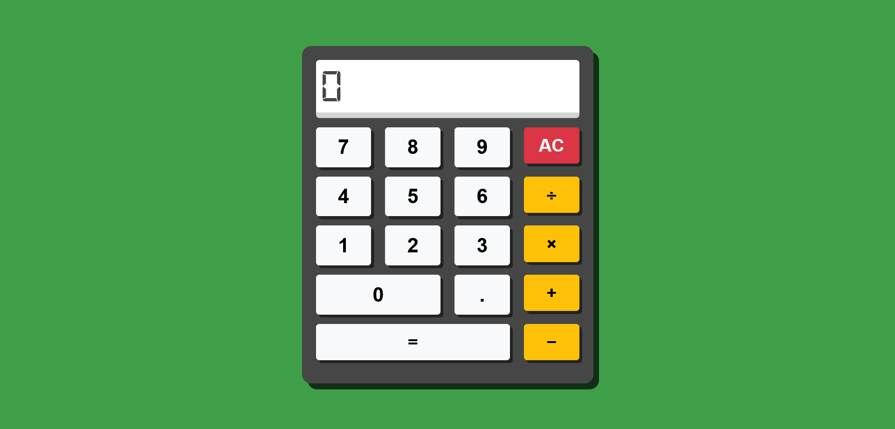

# Calculator

This is a simple calculator application built using HTML, CSS, and JavaScript. The calculator features a basic interface that allows users to perform arithmetic operations such as addition, subtraction, multiplication, and division.

## Table of Contents

- [Design](#design)
- [Project Structure](#project-structure)
- [Features](#features)
- [How to Use](#how-to-use)
- [Scripts](#scripts)
- [Dependencies](#dependencies)
- [Links](#links)
- [License](#license)
- [Author](#author)

## Design

## Project Structure

The project consists of the following files:

| File/Directory               | Description                                                             |
|------------------------------|-------------------------------------------------------------------------|
| `index.html`                 | The main HTML file that contains the structure of the calculator.       |
| `css/style.css`              | The CSS file that styles the calculator interface.                      |
| `css/bootstrap.min.css`      | A CSS file for Bootstrap, used to provide responsive design elements.   |
| `js/main.js`                 | The JavaScript file that handles the calculator's functionality.        |

## Features

- **Responsive Design**: The calculator interface adjusts to different screen sizes using Bootstrap.
- **Basic Arithmetic Operations**: Perform addition, subtraction, multiplication, and division.
- **Clear Function**: Use the "AC" button to reset the calculator.
- **Decimal Support**: The calculator supports decimal input for more precise calculations.

## How to Use

1. Open `index.html` in your web browser.
2. Use the numerical buttons (0-9) to enter numbers.
3. Click the arithmetic operation buttons (`+`, `-`, `×`, `÷`) to perform calculations.
4. Use the `=` button to display the result.
5. Click `AC` to clear the current input and start a new calculation.

## Scripts

- `main.js`: This script handles the logic of the calculator, including user input, arithmetic calculations, and updating the display.

## Dependencies

- **Google Fonts**: The calculator uses the `Bai Jamjuree` and `Orbitron` fonts from Google Fonts.
- **Bootstrap**: Bootstrap is used for the responsive layout and button styling.

## Links

- **Repo**: [Github Repo](https://github.com/basemsameh/Calculator.git)
- **Demo**: [Live URL](https://basemsameh.github.io/Calculator/)

## License

This project is open-source and available under the MIT License.

## Author

- **Name**: [Basem](Basem)
- **GitHub**: [GitHub Profile](https://github.com/basemsameh)
- **Linkedin**: [Linkedin](https://www.linkedin.com/in/basem-sameh-671b5b212/)
